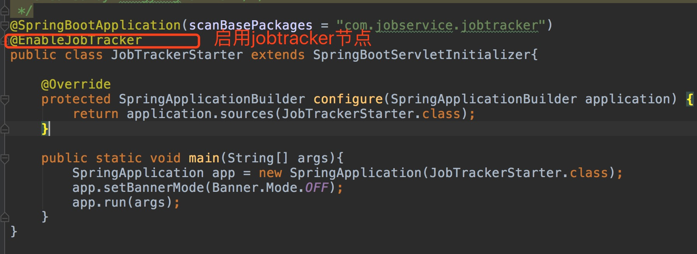
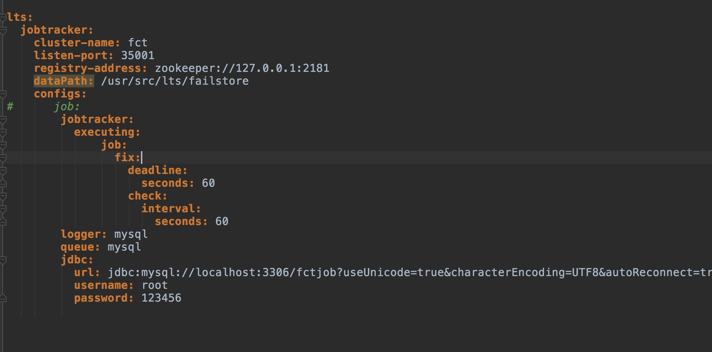
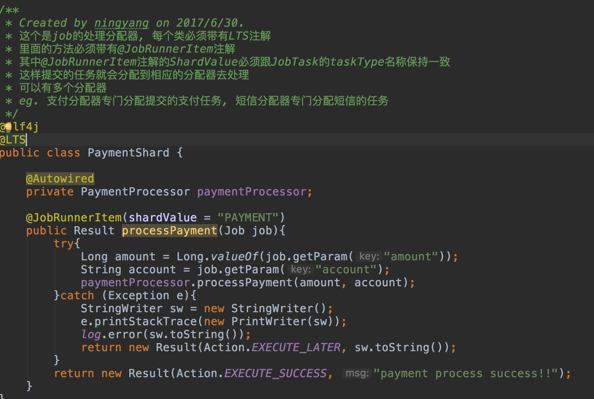
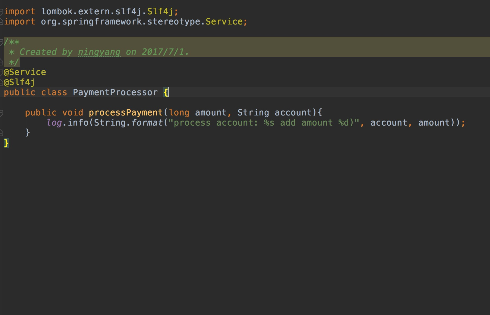
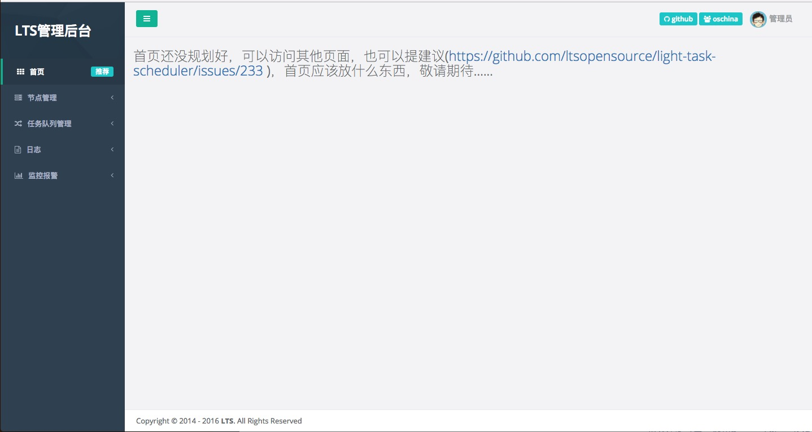
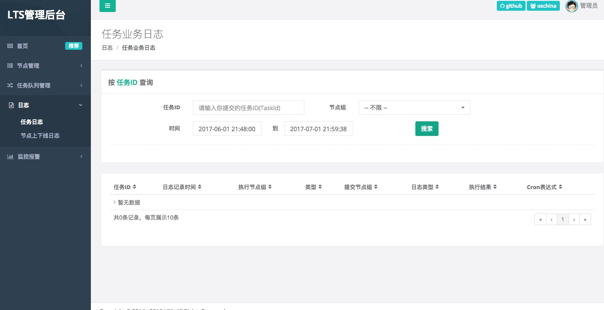

## Job-service(任务调度中心)

```
@author 邱俊
```

### 目录

```
1 任务调度中心节点
2 任务提交
3 任务执行
4 任务结果查看
```

### 任务调度中心节点

```
	任务调度中心依托light schedule task框架开发, 是分布式调度中心, 任务提交都是异步提交, 支持定时,即时,Cron表达式任务, 任务管理后台可以查看提交的任务, 正在执行的任务, 已经完成的任务, 并且可以手动修改任务时间或者新建一个任务, 也能查看任务执行结果。
任务调度中心有3个角色
```
#### 1. job-node
    	任务提交节点, 该节点暴露http接口给到调用方(POST@http://116.62.219.91:5001/job-node/fct/job/submit), Content-type:application-json, body内容为:

```json
     {"taskId":"dasafasfafaf",//taskId为string这个id是任务唯一标识你可以使用业务逻辑字符串标识id,例如: PAYMENT-1
      "params":"",//这是一个map存储你提交给任务所需的参数
      "taskType":"PAYMENT", //代表任务类型 任务类型名称必须跟tasktracker节点当中的shardvalue保持一致	
      "triggerTime":"2017-07-15 12:45:33",//代表你希望在2017-07-15 12:45:33执行任务
      "cronExpression":"0 10 11 * * ?"//cron表达式, tasktracker会根据cron表达式周期性的执行任务, 值得注意的是调用方不能triggerTime和cronExpression一同传过来, 二者选其一
      }
```

#### 2 job-tracker
		任务调度节点, 在该节点当中会把任务提交节点提交的任务放到队列当中进行分配, 这个节点不需要进行二次开发, 属于监视者角色, 只需要配置好mysql和zookeeper, 该节点会自行监测任务




#### 3 job-tasktracker
		任务处理节点, job-tracker节点会分布式的分配给到所有的任务处理节点, 这个节点可以处理任务, 处理方式可以直接自己处理(增加mysql或者其他), 也可以调用其他服务(dubbo,http),在这个节点中必须声明shard(任务分配器, 配合之前job-node提交的任务当中的shard-value), 我在项目当中写了一个例子, 包含相关说明


### 2 任务提交 
		任务提交, 请参考以下代码, 首先先在调用方引用http-client, 这个包我封装在fct-thirdpary-http当中
```
<dependency>
	<artifactId>fct-thirdparty</artifactId>
	<artifactId>fct-thirdparty-http</artifactId>
	<version>1.0-SNAPSHOT</version>
</dependency>
```

```java
String url = "http://116.62.219.91:5001/job-node/fct/job/submit";
String body = JsonConvert.toJson(request);
HttpRequestExecutorManager manager = new HttpRequestExecutorManager(client);
        Request request = new RequestBuilder().post().url(url).body(body).build();
        JsonNodeResponseWrapper wrapper = (JsonNodeResponseWrapper)manager.newCall(request).run().as(JsonNodeResponseWrapper.class);
		JsonNode node = wrapper.convertBody();
```

### 3 任务执行
		提交任务之后, 经由PaymentShard分配给对应的service, 这种方式跟spring声明service一样处理, @service注解, 在service里面执行业务逻辑。




### 4 查看任务结果
		因为调度中心是在lts框架基础开发, 我们继承了lts-admin管理后台, 地址为http://116.62.219.91:8090/index.htm, 账号admin 密码admin


```js
	输入任务id可以查询到相关任务的执行情况
```

